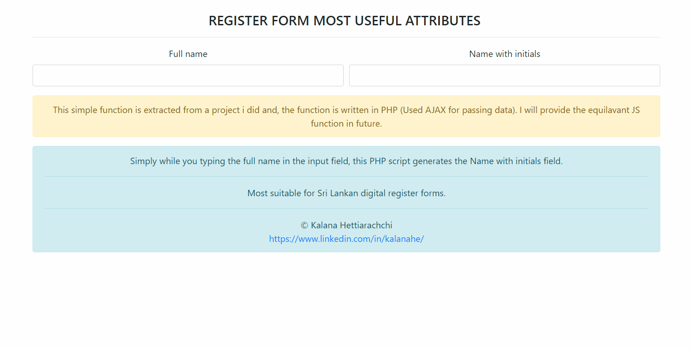

# USEFUL REGISTER FORM AUTOMATED ATTRIBUTES - SRI LANKA FORMAT 

An automated and useful form attribute generate name with initials from full name web form attribute for common Sri Lankan Web applications.

  

## How this works?

```html
-Simply while you typing the full name in the input field, this js script generates the Name with initials field.
```

## Contributing
Since I'm a newbie to programming when i created this project The data structure i used is very bad. So the contributions are very welcomed to improve this.

Pull requests are welcome.   


Please make sure to update the tests as appropriate.

## Demo
[Online Demo](http://35.244.50.5/SL_Web_Form_FullName_To_NameWithInitials)

## Author
[© Kalana Hettiarachchi](https://www.linkedin.com/in/kalanahe/)
  
  
  
  

